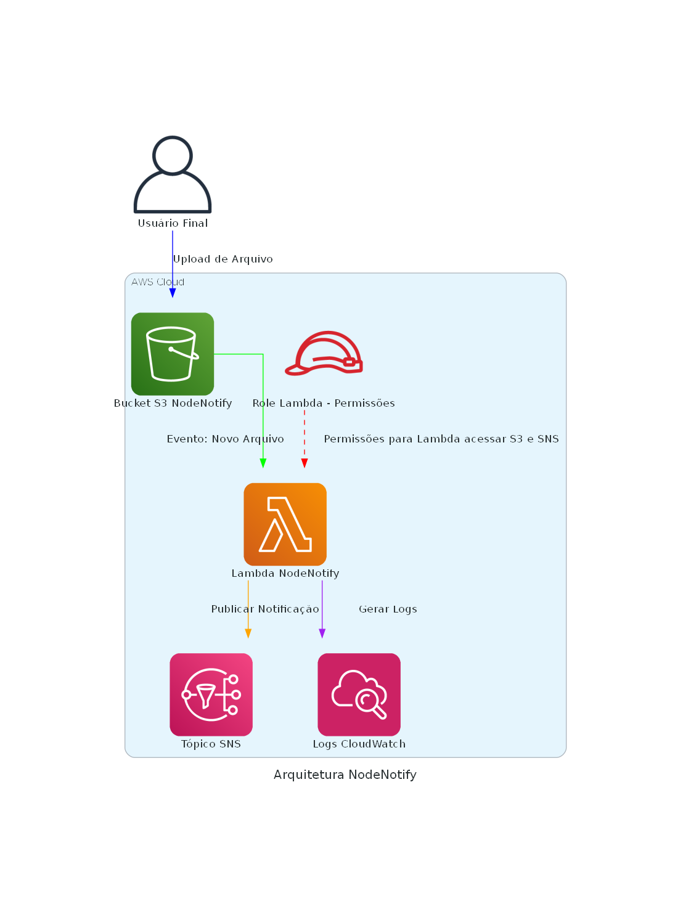

# NodeNotify

## Descrição do Projeto
NodeNotify é uma solução serverless desenvolvida na AWS que monitora atividades em um bucket S3 e envia notificações via SNS (Simple Notification Service) para determinados eventos, como a criação, modificação ou remoção de arquivos. Esse projeto foi implementado em TypeScript e utiliza AWS Lambda para processar os eventos do S3, proporcionando um fluxo de notificações automatizado.

## Arquitetura do Projeto
A arquitetura do projeto envolve os seguintes componentes da AWS:
- **S3 (Simple Storage Service)**: Armazena os arquivos e aciona os eventos sempre que um objeto é adicionado, removido ou modificado.
- **Lambda**: Função serverless que é invocada sempre que ocorre um evento no S3. A Lambda processa o evento e utiliza o SNS para enviar uma notificação.
- **SNS (Simple Notification Service)**: Serviço de notificação utilizado para enviar mensagens de notificação sobre eventos no S3.

Abaixo está o diagrama da arquitetura do NodeNotify:

## Linguagem Utilizada
O projeto foi desenvolvido em **TypeScript**, uma versão de JavaScript que inclui tipagem estática e recursos de desenvolvimento que facilitam a manutenção e qualidade do código.

## Como Funciona
1. **Upload ou Modificação no S3**: Quando um arquivo é adicionado, modificado ou removido no bucket S3, um evento é disparado.
2. **AWS Lambda**: O evento do S3 aciona a função Lambda, que é responsável por processar as informações do evento.
3. **Processamento do Evento**: A função Lambda analisa o evento recebido e cria uma mensagem personalizada de acordo com o tipo de ação (criação, modificação ou remoção do objeto).
4. **Envio da Notificação via SNS**: A mensagem personalizada é enviada para um tópico SNS, que notifica os assinantes configurados (por exemplo, e-mail, SMS, ou outros sistemas).

## Estrutura dos Arquivos
- **index.ts**: Arquivo principal que contém o handler da Lambda. Ele inicializa o SNS e processa os eventos do S3 chamando a função de processamento.
- **s3Processor.ts**: Contém a lógica para processar o evento do S3 e determinar o tipo de mensagem a ser enviada.

## Serviços Utilizados
- **AWS S3**: Armazenamento de arquivos e acionador de eventos para a Lambda.
- **AWS Lambda**: Função serverless que processa eventos do S3 e envia mensagens para o SNS.
- **AWS SNS**: Serviço responsável pelo envio das notificações de eventos do S3 para os assinantes.

## Como Executar o Projeto
1. **Pré-requisitos**: Certifique-se de ter uma conta na AWS com permissões suficientes para criar buckets S3, funções Lambda e tópicos SNS.
2. **Instalação**: Clone este repositório e execute o comando `npm install` para instalar todas as dependências.
3. **Configuração da AWS**: Configure as credenciais da AWS localmente ou através de variáveis de ambiente para que o projeto possa interagir com os serviços AWS.
4. **Deploy**: Faça o deploy da função Lambda compactando os arquivos `index.js`, `s3Processor.js` e a pasta `node_modules`. Faça o upload do arquivo `.zip` no console da AWS Lambda.

## Como Testar
1. **Adicione um arquivo ao bucket S3**: Para disparar o evento, faça o upload de um arquivo no bucket S3 configurado.
2. **Verifique a Notificação**: A Lambda será acionada e enviará uma notificação via SNS, que pode ser recebida por um e-mail ou outro meio configurado.

## Autor
Luan Araujo

## Licença
Este projeto está sob a licença MIT.